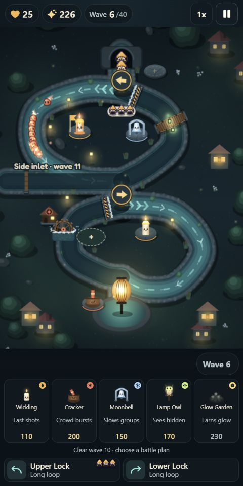
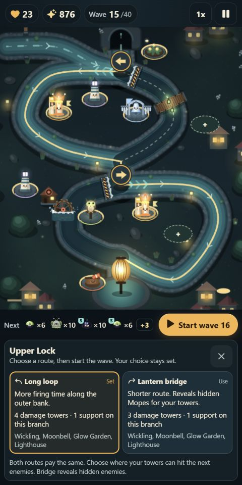
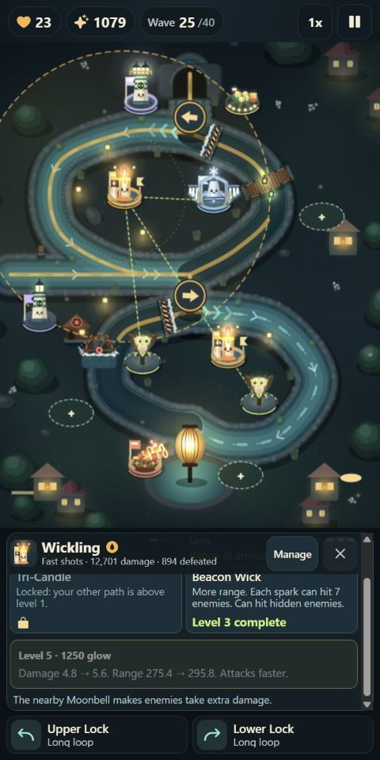
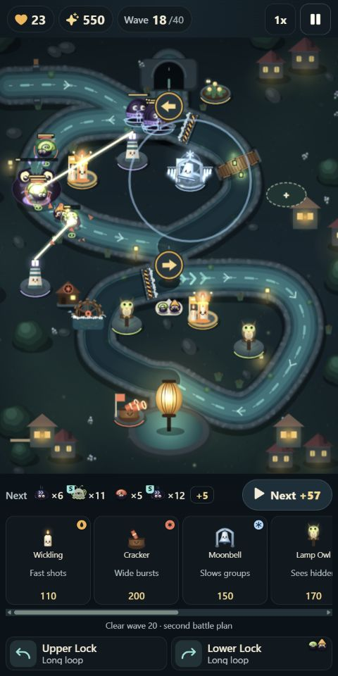
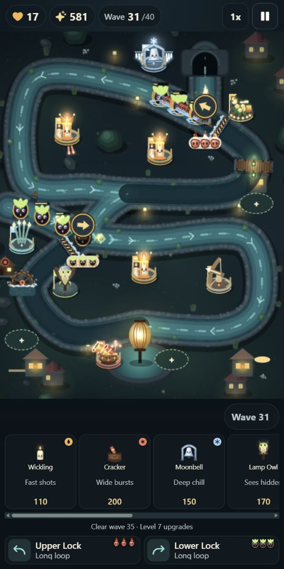
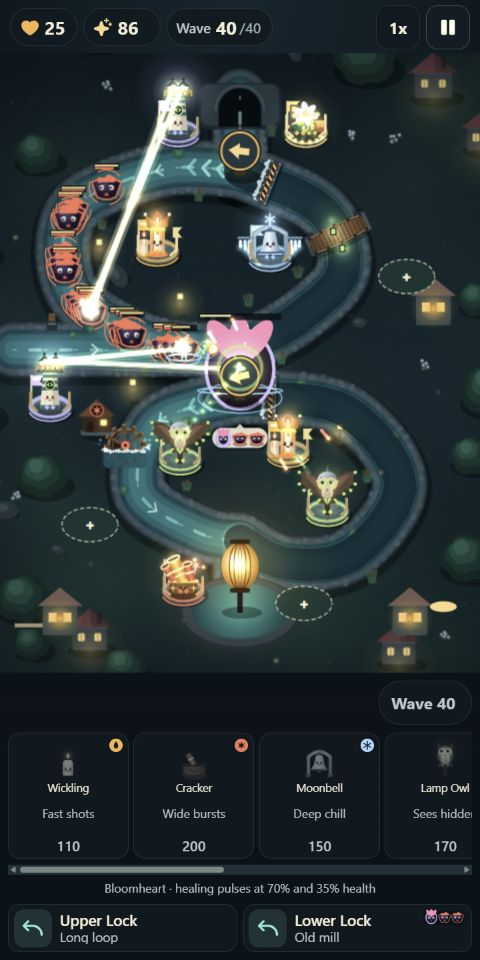

# Lantern Guard: Tower Defense

Build a defence along lantern-lit canals. Place towers, change the enemy's route at the locks, and hold out for 40 waves while your small outpost grows into a fortified riverbank.

## [Play in your browser](https://urbantorque.github.io/lantern-guard/?muted=1)

Works on phones and desktop. No download or sign-in. The demo starts muted; turn sound on in **Settings**. Progress saves in your browser.

### Build, redirect, upgrade

- **Keep your defence.** Buy new building plots and improve the same towers throughout a 40-wave game.
- **Find your favourite mix.** Eight towers, branching upgrades and levels up to 7, from quick-firing Wicklings to chain lightning and heavy Ballistas.
- **Make the route work for you.** Long loops buy firing time. Short routes reveal hidden enemies or break armour.
- **Come back with a different plan.** Four waterways, unlockable guardians that change tower abilities, and optional upgrades with tradeoffs.
- **Play at your pace.** Three difficulty levels, pause to plan, and ten-wave daily and weekly challenges.

## In the game

Six captures from actual gameplay. Tap any image to see it full-size.

<table>
  <tr>
    <td align="center"><a href="docs/screenshots/01-first-defence.png"></a><br><b>Build your first defence</b></td>
    <td align="center"><a href="docs/screenshots/05-route-choices.png"></a><br><b>Choose their route</b></td>
    <td align="center"><a href="docs/screenshots/04-tower-upgrades.png"></a><br><b>Grow your towers</b></td>
  </tr>
  <tr>
    <td align="center"><a href="docs/screenshots/02-reed-crossing.png"></a><br><b>Defend different waterways</b></td>
    <td align="center"><a href="docs/screenshots/03-late-defence.png"></a><br><b>Bring in late-game towers</b></td>
    <td align="center"><a href="docs/screenshots/06-bloomheart.png"></a><br><b>Face Bloomheart</b></td>
  </tr>
</table>

## Your first game

1. Tap a stone plot and choose a tower. Wickling is a cheap start; Cracker hits groups.
2. Start the wave. Use the locks to send enemies past your strongest towers.
3. Spend the glow you earn on upgrades, support towers and more building space.

Start on **Standard**. You can pause to plan and retry a wave if you lose.

---

**In development.** Playable in the browser, with an iOS project included for device testing.

<details>
<summary><b>Run locally and contribute</b></summary>

Requires Node.js 22 or later.

```sh
npm ci
npm run dev
```

Open the localhost URL printed by Vite. `npm run check` runs the regression suites; `npm run build` creates the production game.

[Project guide](docs/PROJECT-GUIDE.md) · [Balance notes](docs/BALANCE-AND-PRESENTATION.md) · [Web deployment](docs/WEB-DEPLOYMENT.md) · [iOS build](docs/IOS-BUILD.md)

</details>
