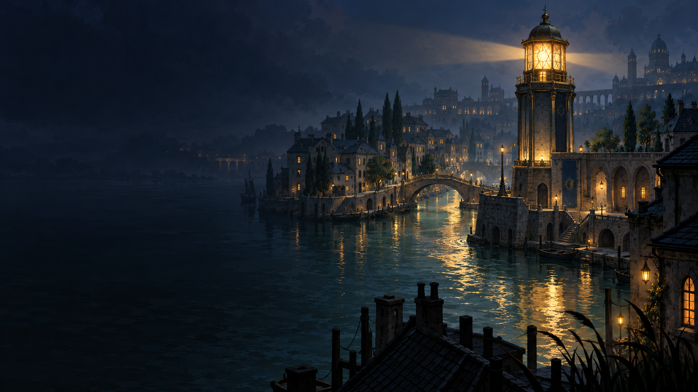

# Nightward

The city sleeps. You keep the light.

Build one defence through a continuous 40-wave campaign. Keep your towers, upgrades and remaining light across five escalating acts as the city reopens around the canal. Twelve-wave expeditions, short encounter practice and custom watches remain available.



- **Four waterways with distinct placement problems.** Reed Crossing's return canal gives its upper island two firing passes. The side inlet bypasses that island, demanding a downstream defence.
- **A handcrafted canal district.** Glazed ceramic towers, reinforced brass machinery, tiled roofs and individually laid canal stones. Cannons open their shutters, mortars kick against recoil pistons, raptor scouts spread metal feathers and ballistas wind their strings. Ember trails, branching lightning, focused sun lances and ground shockwaves distinguish the weapons. Firing and reload timers drive the animation.
- **Fifteen hostile invaders.** Guttermaws, Razorfins, Ironclaws, Wraith Rays, Cinderwings, Gallows Stalkers and ironclad rammers have independent anatomy and movement. Five boss silhouettes add thorn crowns, armoured spines, siege stacks and hinged grinding cores. Small luminous eyes, fangs, barbs and scarred plating replace the friendly faces. The Invaders guide explains every counter. Reduced motion freezes decorative animation.
- **One signature, chosen early.** Choose at wave 4, or wave 3 in expeditions. Sol spreads or consumes fire, Mira freezes or pushes the tide, and Ivo chooses crowd chains or charged hits. The second support-technique choice is removed from new watches. Ivo's lightning arrives at wave 3 for 280 glow; Mira's chimes are available from the start.
- **A deliberate command.** Bank a tower's shot, then choose its moment: Sol ignites burns, Mira freezes crowds or interrupts a boss signal, Ivo concentrates lightning into a chosen target. Designate the command tower in its inspection panel; highlighted targets and a live burn/interrupt readout preview the effect. Holding stops automatic fire. Q banks/releases; discard resumes fire and spends a held command for that wave.
- **Choose your passage.** Restore an island jetty for a permanent thirteenth plot and 180 glow, or reopen a longer side canal for extra runner groups and 90 glow after each of three waves. The decision previews the actual plot and route. It arrives after campaign wave 16, before the hidden fleets and second entrance. Custom chapters, endurance and expeditions retain their original timing.
- **Three heroes, eight towers each.** Sol brings fire and income, Mira brings control and shared sight, Ivo brings speed and electricity. Each roster has different mechanics, names and architecture; new watches use three stages: Base, Specialisation and Crown.
- **Quick, live upgrades.** Compare two compact specialisations, commit to one and upgrade while combat continues. Each tower automatically aims for its role, with imminent leaks taking priority.
- **Distinct crowns and chosen Bonds.** Compatible towers pair automatically over shared water. Choose a different partner or explicitly replace an occupied slot in the tower panel. Changing partners preserves cooldowns. Armour removal, reveals, interrupted healing and signature hits give support towers visible credit.
- **Three authored twelve-wave expeditions.** Sunforge tests armoured convoys and exposed cores. Moonwake's two visible gates reveal hidden foes for six seconds. Stormglass tests linked escorts, separated targets and two firing passes. Earn copper roofs, moonstone lanterns and prismatic windows; completing the set adds a soundtrack accompaniment. Every expedition remains available.
- **Visible support.** The Moon spring reveals nearby hidden foes at night. Small Scout auras and location-based percentage bonuses are folded into the new base balance. Detection, Beacon Bonds and stored sunlight remain distinct support decisions.
- **A watch with room to prepare.** Ordinary waves follow a four-second countdown. Before permanent technique choices, major bosses and the side inlet, the clear river waits for your Ready command. Recovery waves precede bosses, and a two-bank wake tests shared coverage. Combat stays live while you build and upgrade.
- **Prepare for night.** Daylight fills Garden coffers and Scout sunlight reserves. Night reduces income and speeds up enemies; all towers retain their reach. Rain, mist and breeze shape the atmosphere without hidden combat modifiers. Live Gardens earn for the time each tier worked, preventing last-second harvest exploits.
- **Store sunlight.** A scout's support stream trades some attack damage for three daylight charges. At night, automatic pulses briefly extend sight and boost nearby fire rate. Stationary pips and a live charge count show the reserve.
- **An evolving score.** An original 32-bar form with a varied second pass, four waterway arrangements, three hero melodies, a bridge, later-wave accompaniment and a boss pulse. Night changes instrumentation on bar boundaries. Marimba, soft reeds, glass bells and brushed percussion sit alongside water and weather ambience. Defeat sounds distinguish metal, glass and soft creatures. Sound and music preferences remain separate.
- **A clearer battlefield.** Wide screens show the canal across the screen. Phones keep it vertical and frame the selected tower during upgrades. Glow updates immediately, without flying reward particles.
- **Preview before spending.** Selecting a tower shows a ghost, covered water, coverage and compatible Bonds. Confirm the placement to pay. A lantern threat indicator remains visible while a phone drawer is open. Local cues mark the first effect of an upgrade, armour breaks and Bonds; the report recognises support contributions.
- **The Dredger.** Sunforge's new final encounter opens its coral core at two marked bends. It takes 60% damage while closed and 140% while open. Slows extend the opportunity; heavy damage and overlapping coverage both help.
- **Restore three named places during the defence.** The Night Market, Canal Observatory and Waterfront Gardens gain lit stalls, a moving telescope, flowering terraces and residents in the battlefield's existing safe spaces. Act milestones stay on the board; the full campaign result appears after wave 40.
- **Resume a long defence.** Live autosaves preserve the battle exactly. Standard and Gentle defeats can rewind to the current act's saved towers, budget and light. Nightfall ends the run on defeat. Closing the game never consumes a checkpoint.

The original three five-wave District Commissions remain accessible from Expeditions. The continuous campaign, earlier watches, expeditions and short practice have separate save slots. Existing saves keep their original rules, and earned restoration credit is retained. Cosmetic rewards never increase combat power.

## Play and develop

Requires Node.js 22 or later.

```sh
npm ci
npm run dev
```

Open the local URL printed by Vite. Add `?muted=1` for a silent preview. Progress stays on the device. Backgrounding freezes the watch and suspends audio; returning continues without a resume control. Browsers can require a gesture to restore sound.

```sh
npm run check       # Regression suites, saves, sky rules and hero balance
npm run test:siege  # Continuous campaign, act checkpoints and save isolation
npm run balance:siege # Twelve paid 40-wave builds and exact boss resumes
npm run qa:siege    # Paid fixtures and four-size browser campaign checks
npm run test:second-watch # Current rules, map constructions, commands and exact saves
npm run balance:second-watch # Six paid compositions, both passages and all watch formats
npm run test:second-contracts # Nine paid contract completions under current rules
npm run qa:second-watch # Desktop and phone controls, constructions and boss visuals
npm run test:watch-director # Historical director 1 rules and exact saves
npm run balance:director # Paid authored-watch reference matrix, with commands
npm run test:director-contracts # Historical director 1 paid contract completions
npm run qa:director # Current menus and historical command fixtures (Vite port 5176)
npm run balance:watch-depth # 63 paid-build runs across heroes, branches and maps
npm run balance:watch-economy # Income greed, a second forecast and Nightfall
npm run test:watch-craft # Techniques, bestiary rendering, projects and encounter saves
npm run balance:watch-craft # 48 paid-build campaigns/expeditions, all technique pairs
npm run test:watch-experience # Early identities, explicit Bonds, weather and exact saves
npm run test:watch-mastery # Banked command, contracts, exact saves and cosmetic records
npm run balance:mastery # Previous-rules 42-run hero/branch/map reference matrix
npm run test:contracts # Nine paid contract completions and browser fixtures
npm run qa:mastery # New command and contract controls at four viewport sizes
npm run balance:experience # 42 paid builds across all heroes, signatures and maps
npm run qa:experience # Edge checks at desktop and three phone viewports (Vite port 5174)
npm run qa:visual   # 207 icon bounds, motion, projectile contact, render purity and galleries
npm run qa:combat-visual # Late-wave clarity, restored projects, day/night and reduced motion
npm run build       # Typecheck and produce dist/
npm run ios:sync    # Build and sync the Capacitor iOS project
```

Development-only `?qa=1&muted=1` offers reproducible planning states at waves 0, 15, 30 and 39 using fixtures generated by `npm run test:fixed`. The QA watch does not overwrite campaign saves or progression.

`npm run balance:watch-craft` also generates the **Test Dredger** development fixture. The new mechanics use `challenge.watchCraft: 1`; older saves retain their original rules. See [release validation and playtest protocol](docs/CANAL-BESTIARY-RELEASE.md).

The [GitHub Pages address](https://urbantorque.github.io/lantern-guard/) keeps its existing URL. A silent preview never changes your saved sound preference. Publish a clean, committed checkout with `./scripts/publish-pages.ps1`; the script builds and pushes the static site to `gh-pages`. See [deployment instructions](docs/WEB-DEPLOYMENT.md).

## Design and verification

[The Long Watch: continuous 40-wave campaign, act checkpoints and in-run restoration](docs/CONTINUOUS-CAMPAIGN.md)

[Second watch: boss counterplay, chosen commands, constructions and three-stage upgrades](docs/SECOND-WATCH-RELEASE.md)

[Authored watches, 24-wave chapters, deliberate commands and the nocturne menus](docs/AUTHORED-WATCH-RELEASE.md)

[Visual identity, animation and rendering checks](docs/VISUAL-IDENTITY-RELEASE.md)

[Player experience changes and validation](docs/WATCH-EXPERIENCE-RELEASE.md)

[Hero balance, pacing, banked surge and mastery contracts](docs/WATCH-MASTERY-RELEASE.md)

[Strategic depth, landmarks and expeditions](docs/STRATEGIC-DEPTH-RELEASE.md) · [Continuous watch and expressive district](docs/EXPRESSIVE-WATCH-RELEASE.md) · [Battlefield and quick-upgrade revision](docs/BATTLEFIELD-EXPERIENCE-RELEASE.md) · [Continuous combat, upgrade streams and audio fixes](docs/CONTINUOUS-COMBAT-RELEASE.md) · [Three-hero release and visual revision](docs/VIBRANT-HEROES-RELEASE.md) · [Execution roadmap](docs/FIXED-PATH-ROADMAP.md) · [Original fixed-edition delivery](docs/NIGHTWARD-RELEASE.md) · [iOS build guide](docs/IOS-BUILD.md)

Nightward replaces Lantern Guard's playable routing edition. Old battle snapshots remain archived on the device; journal, settlement, achievements and settings carry forward. New records and saves use a separate rules version.

The web build and iOS asset sync are checked. Physical iPhone installation, native performance and observed human playtests still require device validation.
